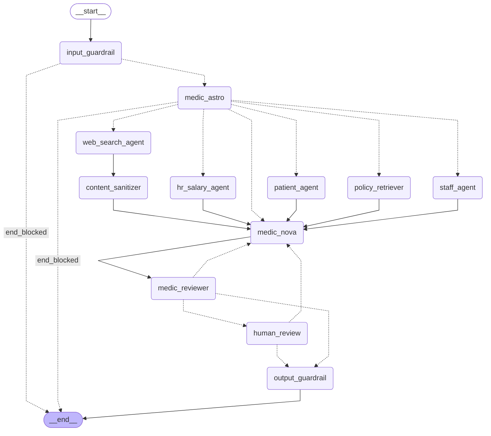

# MEDIC ASTRO graph

```mermaid
---
config:
  flowchart:
    curve: linear
---
graph TD;
	__start__([<p>__start__</p>]):::first
	input_guardrail(input_guardrail)
	medic_astro(medic_astro)
	policy_retriever(policy_retriever)
	web_search_agent(web_search_agent)
	content_sanitizer(content_sanitizer)
	staff_agent(staff_agent)
	hr_salary_agent(hr_salary_agent)
	patient_agent(patient_agent)
	medic_nova(medic_nova)
	medic_reviewer(medic_reviewer)
	human_review(human_review)
	output_guardrail(output_guardrail)
	__end__([<p>__end__</p>]):::last
	__start__ --> input_guardrail;
	content_sanitizer --> medic_nova;
	hr_salary_agent --> medic_nova;
	human_review -.-> medic_nova;
	human_review -.-> output_guardrail;
	input_guardrail -. &nbsp;end_blocked&nbsp; .-> __end__;
	input_guardrail -.-> medic_astro;
	medic_astro -. &nbsp;end_blocked&nbsp; .-> __end__;
	medic_astro -.-> hr_salary_agent;
	medic_astro -.-> medic_nova;
	medic_astro -.-> patient_agent;
	medic_astro -.-> policy_retriever;
	medic_astro -.-> staff_agent;
	medic_astro -.-> web_search_agent;
	medic_nova --> medic_reviewer;
	medic_reviewer -.-> human_review;
	medic_reviewer -.-> medic_nova;
	medic_reviewer -.-> output_guardrail;
	patient_agent --> medic_nova;
	policy_retriever --> medic_nova;
	staff_agent --> medic_nova;
	web_search_agent --> content_sanitizer;
	output_guardrail --> __end__;
	classDef default fill:#f2f0ff,line-height:1.2
	classDef first fill-opacity:0
	classDef last fill:#bfb6fc

```
